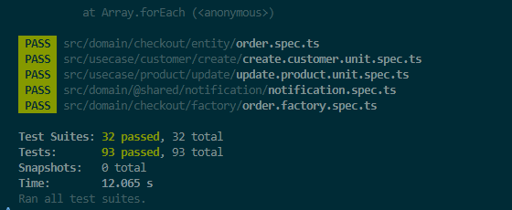

# FC3-CleanArch-ProductNotificationValidation  

## Description  

This project is part of the **Full Cycle 3.0** course challenge, focusing on implementing the **Notification Pattern** and a **Validation Process** for the `Product` entity.  

The implementation is written in **TypeScript** and follows **Clean Architecture** principles, ensuring **separation of concerns**, **scalability**, and **maintainability**.  

Additionally, this repository builds upon a previous challenge, which involved developing the `Product` use case and exposing it via a **REST API**. You can find that challenge [here](https://github.com/LuisGaravaso/FC3-CleanArch-ProductAPI).  

## Challenge Requirements  

To successfully complete this challenge, the following requirements must be met:  

- Implement the **Notification Pattern** and the **Validation Process** for the `Product` entity.  
- Ensure robust **unit testing** to validate the correctness of the entities.  
- Maintain a well-structured and modular codebase following **Clean Architecture** principles.  

## Installation & Setup

###
Cloning the Repository

To get started, clone the repository and navigate to the project directory:
```sh
git clone https://github.com/LuisGaravaso/FC3-CleanArch-ProductNotificationValidation.git
cd FC3-CleanArch-ProductNotificationValidation
```

### Prerequisites
Ensure you have the following installed on your machine:
- [Node.js](https://nodejs.org/en/download) (latest LTS version recommended)
- [npm](https://www.npmjs.com/) (included with Node.js)

### Install Dependencies
Run the following command to install the required dependencies:
```sh
npm install
```
After downloading the packages the folder `node_modules` should appear.

## Running Tests
To execute all unit tests, use the following command:
```sh
npm test
```
All tests should pass as follows.



## Clean Architecture Concepts  
This project follows **Clean Architecture** principles, ensuring a modular and maintainable codebase. The structure revolves around key concepts:  

### **Entity**  
Entities represent core business objects with a unique identity that persists over time. They encapsulate fundamental rules and behaviors, ensuring domain integrity. In this project, entities include:  
- **`Customer`**  
- **`Product`**  

Entities are **self-contained** and should not depend on external infrastructure, reinforcing **separation of concerns**.  

### **Notification Pattern & Validation Process**  
To enhance entity integrity and maintain clear error reporting, this project implements the **Notification Pattern** and a **Validation Process**:  

- **Notification Pattern**:  
  - Used to collect and manage domain-specific validation errors without immediately throwing exceptions.  
  - Instead of failing fast, entities **aggregate errors** and allow the application layer to decide how to handle them.  
  - This approach improves **flexibility** and **separation of concerns**, making it easier to validate multiple conditions while keeping entities clean.  
  - Example: If a `Product` has an invalid `name` and `price`, both errors are recorded and returned at once, rather than stopping at the first failure.  

- **Validation Process**:  
  - Each entity has **business rules** that need validation before being persisted or used in operations.  
  - The validation layer ensures attributes like `Product.name` and `Product.price` meet the necessary constraints (e.g., **non-empty name, price greater than zero**).  
  - This validation is **encapsulated within the domain layer**, reinforcing **Clean Architecture** principles.  

### **Repository**  
Repositories act as an abstraction layer between **domain entities** and the **persistence mechanism**. They handle operations such as storing, retrieving, and updating entities while hiding infrastructure details. Examples include:  
- **`CustomerRepository`**  
- **`ProductRepository`**  

Repositories ensure the domain logic remains independent of the database implementation, enabling **easier refactoring and testing**.  

### **Use Case**  
Use cases define the **business logic** of the application by orchestrating interactions between **entities** and **repositories**. They encapsulate workflows and enforce **business rules**, ensuring **consistency and integrity**. Examples include:  
- `create`, `find`, `list`, and `update` operations for **Customer** and **Product**.  

By keeping business rules within **use cases**, the application remains **scalable, testable, and adaptable** to future changes.  

## Project Structure
The project follows a structured **Clean Architecture** approach:
```
/src
│── domain/                # Core business logic, including entities, domain rules, and validation
│   ├── @shared/           # Shared domain logic and utilities (e.g., notifications, base entities, value objects)
│   ├── checkout/          # Checkout domain logic, including order processing
│   ├── customer/          # Customer domain, encapsulating business rules and validation
│   │     ├── entity/          # Customer entity definition and behavior
│   │     ├── factory/         # Factory methods for creating Customer instances
│   │     ├── repository/      # Interfaces for customer persistence operations
│   │     ├── validator/       # Customer validation rules
│   │     ├── value-object/    # Value objects related to the Customer domain
│   ├── product/           # Product domain, encapsulating business rules and validation
│   │     ├── entity/          # Product entity definition and behavior
│   │     ├── factory/         # Factory methods for creating Product instances
│   │     ├── repository/      # Interfaces for product persistence operations
│   │     ├── validator/       # Product validation rules
│   │     ├── service/         # Business logic that doesn’t fit into entities (e.g., pricing rules)
│   │     ├── value-object/    # Value objects related to the Product domain
│── infrastructure/        # Handles external integrations such as databases, APIs, persistence layers, and frameworks
│── usecase/               # Application-specific business logic (Use Cases), coordinating domain logic with repositories


```
**NOTE: Only the main folders for this challenge are expanded**

## Database
- This project uses **SQLite** as an in-memory database for testing purposes.
- No additional database setup is required.

Here's an improved and more professional version of your **Test Coverage Summary**, with **clearer explanations** and **better formatting for code samples**:

---

## **Test Coverage Summary**  

### **Unit Tests**  
The unit tests for the `Product` entity were adjusted to align with the **Notification Pattern** and **Validation Process**. Instead of immediately throwing an exception when the first validation error is encountered, the new approach **aggregates multiple errors** and reports them collectively.  

This ensures that all validation issues are captured at once, improving **error handling** and **developer experience**.  

### **Main Test Files**  
- `product.spec.ts`  
- `product-b.spec.ts`  

### **Sample Tests**  

#### **Validating Required Fields**  
```typescript
it("should collect errors when name and id are empty", () => {
  expect(() => {
    const product = new Product("", "", 100);
  }).toThrowError("product: Id is required,product: Name is required");
});
```

#### **Validating Multiple Errors Simultaneously**  
```typescript
it("should collect errors when name is empty and price is less than zero", () => {
  expect(() => {
    const product = new Product("123", "", -1);
  }).toThrowError("product: Name is required,product: Price must be greater than zero");
});
```

### Other tests
- They were implemented in the previous challenge.
- Information on them [available here](https://github.com/LuisGaravaso/FC3-CleanArch-ProductAPI) 